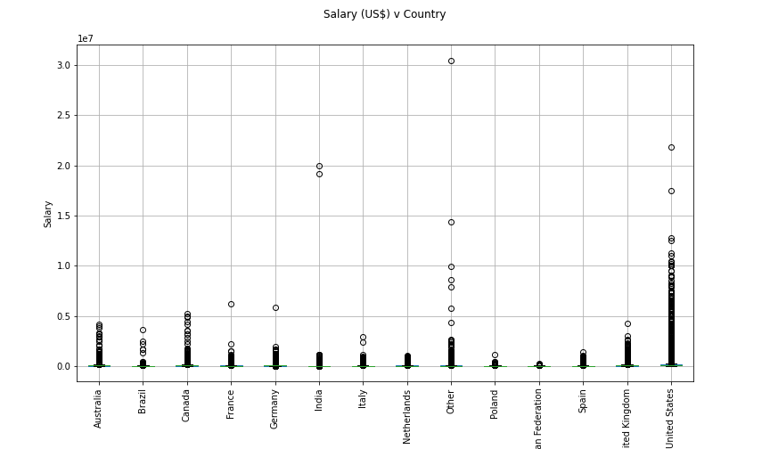

# Salary-Prediction

<!-- ABOUT THE PROJECT -->
## About The Project

Application to predict salary of an employee based on basic information like experience, country, education etc. This application uses Knowledge of data provided by StackOverlow which comes from a servey
it conducts every year. Stack Overflow annual developer survey include over 70,000 responses to curate the whole data. for csv file please refer to https://insights.stackoverflow.com/survey.

 - Try Out the app
  ```sh
  https://rishabh422tiwari-salary-prediction-app-7ytcny.streamlitapp.com/
  ```

This is how end application would look like :


## Getting started

Since desired output is continous we can use any variation of regression model. i have compared 3 models linear regression, Random Forest and Decision Tree in which i found decision tree worked the best for the type of data we have.

### Walkthrough the Process

1. Installing all the dependencies
2. Pre-processing of the data
    - Droping irrelevent Columns
    - Dealing with NaN values and null values
    - Removing the outliers
      Our Raw data with outliers
      
      
      Our data after removing outliers
      
    - Encoding the categorical labels with scikit-learn lib.
 3. Trial of 3 different models (linear reg, random forest, decision tree)
 4. Evaluating with model performing well
 5. Making web application with Streamlit
## Built With

1. Numpy
2. Pandas
3. Matplotlib
4. scikit-learn
5. streamlit
